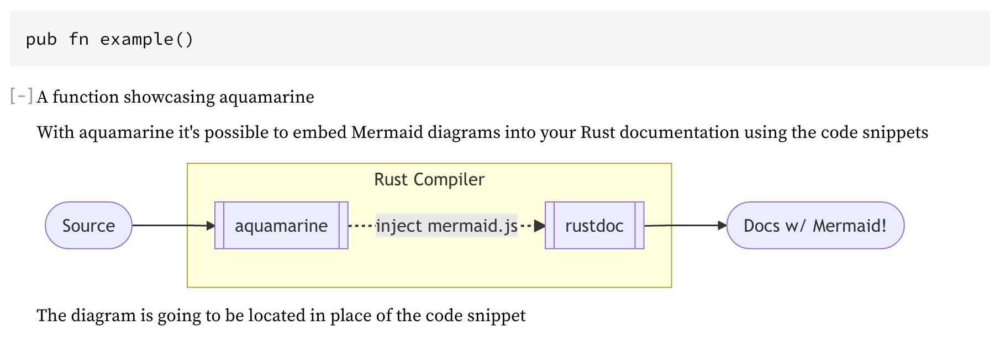
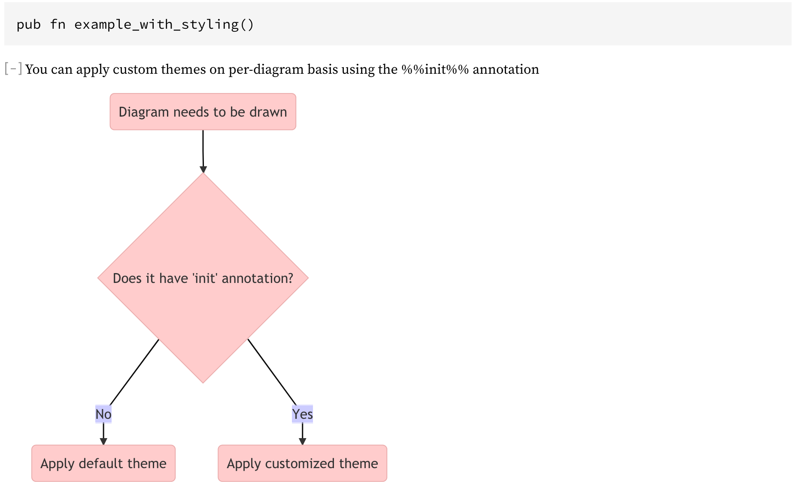

# Aquamarine

[](LICENSE)
[](https://crates.io/crates/aquamarine)
[](https://docs.rs/aquamarine)


Aquamarine is a procedural macro extension for [rustdoc](https://github.com/mersinvald/dotfiles), 
that aims to improve the visual component of Rust documentation through use of the [mermaid.js](https://mermaid-js.github.io/mermaid/#/) diagrams.

`#[aquamarine]` macro works through embedding the [mermaid.js](https://github.com/mermaid-js/mermaid) into the generated rustdoc HTML page, modifying the doc comment attributes.

To inline a diagram into the documentation, use the `mermaid` snippet in a doc-string:

```rust 
#[cfg_attr(doc, aquamarine::aquamarine)]
/// ```mermaid
/// graph LR
///     s([Source]) --> a[[aquamarine]]
///     r[[rustdoc]] --> f([Docs w/ Mermaid!])
///     subgraph rustc[Rust Compiler]
///     a -. inject mermaid.js .-> r
///     end
/// ```
pub fn example() {}
``` 
The diagram will appear in place of the `mermaid` code block, preserving all the comments around it. You can even add multiple diagrams!

To see it in action, go to the [demo crate](https://docs.rs/aquamarine-demo-crate) docs.rs page.



You can learn more about `mermaid.js` and what it can do in the mermaid's [documentation MdBook](https://mermaid-js.github.io/mermaid/#/)

### Dark-mode

Aquamarine will automatically select the `dark` theme as a default, if the current `rustdoc` theme is either `ayu` or `dark`.

You might need to reload the page to redraw the diagrams after you change the theme to see the changes.


### Custom themes

Theming is supported on per-diagram basis, through the mermaid's `%%init%%` attribute.

*Note*: custom theme will override the default theme

```rust
/// ```mermaid
/// %%{init: {
///     'theme': 'base',
///     'themeVariables': {
///            'primaryColor': '#ffcccc', 
///            'edgeLabelBackground':'#ccccff', 
///            'tertiaryColor': '#fff0f0' }}}%%
/// graph TD
///      A(Diagram needs to be drawn) --> B{Does it have 'init' annotation?}
///      B -->|No| C(Apply default theme)
///      B -->|Yes| D(Apply customized theme)
/// ```
```



To learn more, see the [Theming Section](https://mermaid-js.github.io/mermaid/#/theming) of the mermain.js book
